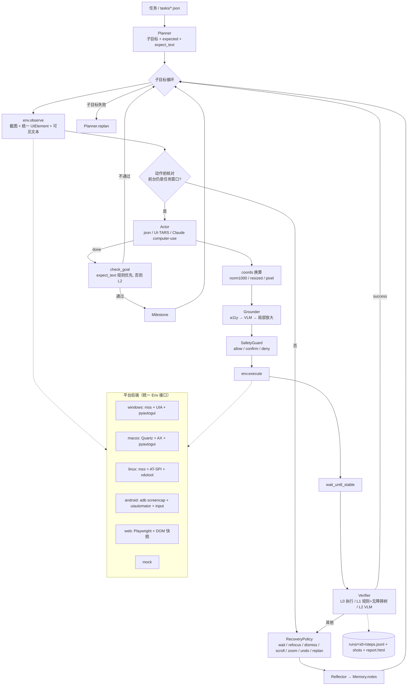

# gui-agent（`gua`）：跨平台、可验证执行与失败恢复的 GUI Agent

SRTP 研究代码 v0.2。前身是只支持 Windows 的 `win-gui-agent`（`wga`）。研究方向 A：**执行验证与失败恢复**
（时间失配：页面没刷新就判断、窗口被最小化/抢焦点、目标在屏幕外……）。

一套核心（规划 → 定位 → 安全闸门 → 执行 → 分级验证 → 分类恢复 → 反思 → 里程碑）跑在 6 个后端上：
**Windows / macOS / Linux(X11) / Android(adb) / Web(Playwright) / Mock**。

- 设计说明：[docs/design.md](docs/design.md)
- 开源 computer-use agent 调研与取舍：[docs/research.md](docs/research.md)

## 架构



目录：

```
gua/
  actions.py      统一动作空间（click/double/right/long_press/drag/scroll/type/hotkey/wait/open_app/navigate/back/home/focus_window/ask_user/done/fail）
  parsing.py      JSON 动作、坐标点、UI-TARS 原生输出解析
  coords.py       坐标约定换算（norm1000 / norm1 / resized(smart_resize) / pixel）
  env/            base.py（Env / UIElement / Observation）、a11y.py（各平台无障碍树→统一元素）、
                  windows.py macos.py linux.py android.py web.py mock.py desktop.py（pyautogui 输入层）
  llm/            openai_compat.py（GPT / Qwen-VL@DashScope / UI-TARS@vLLM）、anthropic.py（Messages API + computer-use 工具映射）
  planner.py      Planner / Actor / UITarsActor
  grounding.py    a11y 匹配 → VLM → RegionFocus 局部放大
  verify/         L0/L1/L2 分级验证、像素差
  recovery.py     失败分类 → 平台化最小恢复动作
  reflection.py   反思器
  memory.py       步骤历史 / 里程碑 / 反思笔记 / 循环检测
  safety.py       危险动作确认闸门、域名白名单、ask_user
  agent.py        主循环 + 预算/步数/时间限制
  logger.py report.py   轨迹 JSONL + 截图 + HTML 回放
  scripted.py     脚本策略（离线“假模型”，测试 / CI / 演示用）
  eval/           runner.py（指标）checkers.py（判分）disturb.py（按步注入干扰）
configs/          default.yaml、models/*.yaml、ablations/*.yaml、web_local.yaml、mock.yaml
tasks/            windows/ macos/ linux/ android/ web/ + web_assets/*.html（自包含的本地网页任务）
tests/            mock 单元测试、fixture 解析测试、真实 Chromium 集成测试
```

## 安装

```bash
pip install -e ".[dev]"                 # 核心 + 测试（mock 平台即可跑）
pip install -e ".[web]" && playwright install chromium     # Web
pip install -e ".[windows]"             # Windows：mss + uiautomation + pyautogui
pip install -e ".[macos]"               # macOS：pyobjc（Quartz / ApplicationServices / Cocoa）+ pyautogui
pip install -e ".[linux]"               # Linux X11：mss + pyautogui；AT-SPI: sudo apt install python3-pyatspi gir1.2-atspi-2.0 xdotool wmctrl
# Android：只需要 PATH 里有 adb（platform-tools），手机开启 USB 调试或使用模拟器
gua doctor                              # 检查各后端依赖
```

## 快速开始

**0. 无需 API key 的离线演示（真实浏览器 + 脚本策略）**

```bash
gua demo                    # = gua eval tasks/web --policy scripted
gua replay runs/<run_id> --open
```

**1. 配置模型**（任选其一，叠加到默认配置上 `-m`）

```bash
export OPENAI_API_KEY=...      ; M=configs/models/openai_gpt4o.yaml    # GPT-4o 规划 + 本地 UI-TARS 定位
export DASHSCOPE_API_KEY=...   ; M=configs/models/qwen_dashscope.yaml  # 全部 Qwen2.5-VL（百炼，无需 GPU）
export GROUNDER_API_KEY=EMPTY  ; M=configs/models/uitars_vllm.yaml     # UI-TARS-1.5-7B 端到端（vLLM 部署）
export ANTHROPIC_API_KEY=...   ; M=configs/models/claude.yaml          # Claude computer-use 工具（端到端）
```

**2. 各平台运行**

```bash
# Web（本地页面或任意 URL；--headed 显示浏览器）
gua run --platform web -m $M --url tasks/web_assets/form.html --window "Contact form" \
        --task "填写姓名 Alice、邮箱 alice@example.com，选 Pro 套餐并提交"

# Windows（v0.1 的任务照常可用）
gua run --platform windows -m $M --window 记事本 --task "在记事本末尾输入 SRTP 测试完成 并保存"

# macOS（先给终端授予“辅助功能”和“屏幕录制”权限）
gua run --platform macos -m $M --window TextEdit --task "在 TextEdit 里输入 hello 并保存"

# Linux（X11 会话；Wayland 下不可用）
gua run --platform linux -m $M --window gedit --task "在 gedit 里输入 hello 并保存"

# Android（adb devices 能看到设备；--window 写包名用于“App 被切走”检测）
gua run --platform android -m $M --app com.android.settings --window com.android.settings \
        --task "打开 网络和互联网，告诉我 Wi-Fi 是否开启"
```

危险动作（删除/支付/发送、`rm -rf`、Alt+F4、往密码框输入……）默认在终端询问；`--deny` 一律拒绝，`--yes` 一律放行（只在虚拟机里用）。
模型可以输出 `ask_user` 向你提问。

## 模型配置

`configs/default.yaml` 中 `models.{planner,actor,grounder,verifier,reflector}` 各自独立，`null` 表示复用上一个：

| 字段 | 说明 |
|---|---|
| `provider` | `openai`（任何 OpenAI 兼容接口：OpenAI / DashScope / vLLM / Ollama）或 `anthropic` |
| `model` / `base_url` / `api_key_env` | 模型名、接口地址、存 key 的环境变量名 |
| `image_max_side` | 发送前缩放截图（控制 token） |
| `actor.kind` | `json`（默认，planner–grounder 分离）/ `uitars`（端到端）/ `claude_computer_use`（端到端） |
| `actor.coord_space` | `null` 时 actor 只给 element_id/描述；设为 `norm1000`/`resized`/`pixel` 时 actor 直接给坐标 |
| `grounding.coord` / `max_pixels` | grounder 的坐标约定：Qwen2.5-VL / UI-TARS-1.5 用 `resized` 且 `max_pixels` 要与部署一致；UI-TARS-1.0 / SeeClick 用 `norm1000` |

## 评测

```bash
gua eval tasks/web --policy scripted                       # 离线
gua eval tasks/web -m $M --repeats 3 --tag main             # 真实模型
gua eval tasks/windows -m $M -c configs/ablations/raw_loop.yaml --tag raw
python scripts/compare.py runs/summary-*.json               # 汇总成 Markdown 表
```

任务 JSON 字段见 `gua/eval/runner.py` 顶部注释：`platform`、`instruction`、`task_window`、`start_url`、`setup`、`checks`、
`teardown`、`disturbance`（`{"kind": "new_tab", "at_step": 3}`，按步注入、可复现）、`demo`（脚本策略）。

指标：`success_rate`、**`false_done_rate`（宣称完成但判分失败 / 宣称完成数）**、`recovery_rate`（有干扰且通过 / 有干扰运行数）、平均步数 / 模型调用 / token / 耗时。

自带任务：

| 平台 | 任务 | 测什么 |
|---|---|---|
| web | form_submit / todo_add | 基本表单、输入框值与复选框的 L1 核验 |
| web | delayed_report | 加载中等待（旧报告是陈旧证据，`raw_loop` 会错误宣告完成） |
| web | modal_export | 点击被意外弹窗吞掉 → BLOCKED → 处理弹窗 → 重做 |
| web | long_page_save | 目标在视口外 → 越界 → 按距离滚动 → 重做 |
| web | form_focus_steal | 第 3 步前新标签页抢焦点 → 动作前核对 → 恢复焦点 |
| windows | notepad_append_save / calc_result_to_notepad / explorer_make_folder | v0.1 任务（抢焦点 / 弹窗干扰） |
| android | settings_wifi / contacts_add | Home 键干扰、App 切回 |
| linux / macos | gedit_hello / textedit_hello | 文本编辑 + 保存 |

## 消融

| 配置 | 含义 |
|---|---|
| `configs/default.yaml` | 主方法：事件触发验证 + 分类恢复 + 收尾核验 + 反思 + 安全闸门 |
| `ablations/raw_loop.yaml` | 基线 1：不验证、不恢复、不收尾核验 |
| `ablations/fixed_retry.yaml` | 基线 2：规则检测 + 失败原样重试 |
| `ablations/every_step_verify.yaml` | 基线 3：每步都调 L2（成本上界） |
| `ablations/no_goal_check.yaml` | 去掉收尾核验（看 false_done 来源） |
| `ablations/vision_only.yaml` | 不用无障碍树（定位与 L1 都只靠视觉） |
| `ablations/no_reflection.yaml` | 去掉反思器 |

所有配置共享 `agent.max_budget_calls`，保证同预算对比。

## 测试

```bash
pytest -q                 # 全部（没有 playwright/chromium 时 web 集成测试自动跳过）
pytest -q -m "not web"    # 只跑 mock / fixture / 离线后端测试（CI 三平台矩阵）
```

本次在沙箱（Linux aarch64，Python 3.12，Playwright 1.63 + Chromium headless shell）中的结果：**52 passed**。
GitHub Actions：`core` 任务在 ubuntu / windows / macos × Python 3.10 / 3.12 上跑 `-m "not web"`；`web` 任务在 ubuntu 上装 Chromium 跑全部测试 + `gua demo`。

## 哪些验证过、哪些没有（诚实说明）

| 部分 | 状态 |
|---|---|
| 核心逻辑（动作解析、坐标、验证规则、恢复决策、记忆、反思、安全、预算、日志/报告、CLI） | ✅ mock 单元测试 |
| **Web 后端** | ✅ 沙箱内真实 Chromium 端到端：6 个本地任务全部通过，等待 / 弹窗 / 滚动 / 抢焦点 4 条恢复路径都真实触发；`raw_loop` 基线在 delayed_report 上复现“错误宣告完成”；安全闸门拦下“Delete account” |
| Android 后端 | 🟡 只做了 fixture 测试：uiautomator XML 解析、adb 命令构造（假 adb）。**未连接真机/模拟器** |
| Linux 后端 | 🟡 只测了 AT-SPI 树 → 元素转换（fixture）。沙箱无 X11 桌面，**未端到端运行** |
| macOS 后端 | 🟡 只测了 AX 树 → 元素转换（fixture，含 Retina 倍率）。**未在 Mac 上运行**（pyobjc 调用为按文档编写） |
| Windows 后端 | 🟡 v0.1 代码迁移到新接口（UIA 角色映射 + 公共输入层），**v0.2 未在真机复测** |
| 模型后端 | 🟡 只测了请求构造与响应映射（OpenAI 兼容、Anthropic Messages、computer-use 工具、UI-TARS 解析），**没有用真实 API 跑过任务** |
| 脚本策略 | ⚠️ 只证明非模型部分可用；L2 验证在脚本模式下是乐观桩，不代表真实模型能力 |

## 已知限制

见 [docs/design.md §8](docs/design.md)。主要是：Wayland 不支持、Android 中文输入需 ADBKeyboard、Claude computer-use 采用无状态逐步调用、
未实现 MCP / 代码动作 / OmniParser。

## 致谢与参考

动作空间、坐标约定、a11y+视觉融合、反思、安全设计参考了 Agent S2/S3、UFO²/UFO³、UI-TARS、OpenCUA、browser-use、
Mobile-Agent-v3、AppAgent、OS-Copilot、Cradle、Anthropic computer-use 参考实现、OpenAI CUA sample app、Open Interpreter，
以及 OSWorld / AndroidWorld / WindowsAgentArena 评测框架。详见 [docs/research.md](docs/research.md)。
