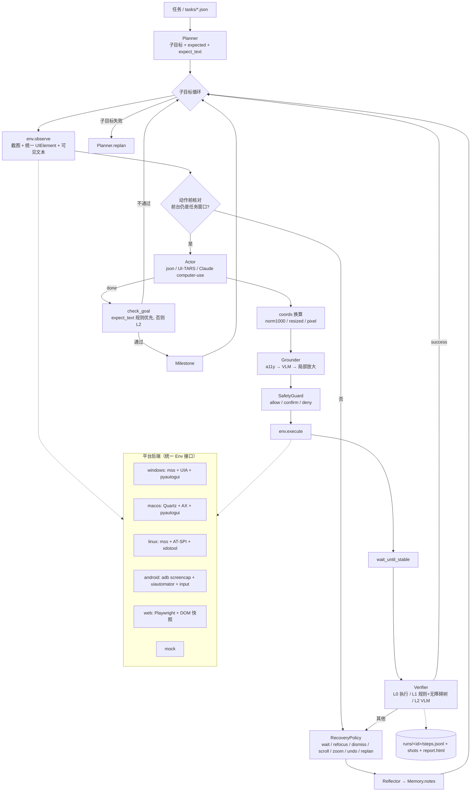

# gui-agent（`gua`）：跨平台、可验证执行与失败恢复的 GUI Agent

SRTP 研究代码 **v0.3.1**（v0.3 修复第一轮代码审查的 12 个问题；v0.3.1 修复第二轮审查的 7 个问题及自查发现的同类问题，
见下方更新日志与 [docs/review-fixes.md](docs/review-fixes.md)）。当前工作树包含第三、第四轮安全修订，**尚未发布新版本**。
前身是只支持 Windows 的 `win-gui-agent`（`wga`）。研究方向 A：**执行验证与失败恢复**
（时间失配：页面没刷新就判断、窗口被最小化/抢焦点、目标在屏幕外……）。

一套核心（规划 → 定位 → 安全闸门 → 执行 → 分级验证 → 分类恢复 → 反思 → 里程碑）跑在 6 个后端上：
**Windows / macOS / Linux(X11) / Android(adb) / Web(Playwright) / Mock**。

- 设计说明：[docs/design.md](docs/design.md)
- 审查修复对照（四轮；审查条目 → 改动 → 回归测试）：[docs/review-fixes.md](docs/review-fixes.md)
- 开源 computer-use agent 调研与取舍：[docs/research.md](docs/research.md)

## 更新日志

### 未发布（第四轮审查修复）

- **导航同源隔离**：启用域名白名单时，保留非 GET/HEAD 方法的跨源导航重定向（如 POST → 307/308）在请求下一跳前
  被拒绝，避免把目标文档作为来源站点的文档执行。普通 GET 跳转、POST → 301/302/303 → GET 和同源 POST 跳转仍可用。
- **输入目标身份**：Web 输入核对安全观察中的实际元素句柄、页面与 frame；确认期间换框、刷新后复用 DOM 编号、
  控件密码属性改变时中止输入，重新观察后再判断。clear/type/submit 前检查焦点，清空过程中移焦也立即中止。
- **Android 滚动**：指定 x/y 的 scroll 先用整数计算滑动端点，再生成 adb 参数，避免字符串运算导致运行崩溃。
- **纯视觉消融**：步骤级 L2 验证遵守 `a11y_in_prompts`，关闭文字信息时不再附带动作前后的 DOM/无障碍文字。

修复对应关系与验证结果见 [第四轮修复记录](docs/review-fixes.md#第四轮审查修复)。

### 未发布（第三轮安全修订）

- **重定向**：检查与请求共用严格 URL 规范化，拒绝反斜杠、userinfo、含糊的数字 IP 等歧义地址；
  跳转页改为正确编码的无脚本 `meta refresh`，不继承妨碍合成页跳转的 3xx CSP，目标页的 CSP 保持不变。
  手动跟随逐跳维护方法、正文和请求头；POST 转 GET 后不再恢复原正文，跨源不重放源站认证头。
- **输入边界**：`hotkey` 只接受“修饰键 + 一个非修饰键”，移焦与激活必须拆开重新观察；敏感字符混入控制键也脱敏，
  按键拒绝签名只存哈希。表单点击与提交共享真实提交目标身份；清空或输入期间移焦时停止后续 Web 输入。
- **密码观察**：识别 autocomplete token 列表，排除安全节点的文本子树；密码名称统一为 `password field`，不再信任平台返回的
  name / description。closed shadow root 等不可证明的输入焦点按 unknown 处理。
- **真实文本过闸**：秘密占位符先展开，再检查最终输入的危险模式、控制字符和提交语义；未配置的占位符直接拦截。
  安全闸门、执行器和清洗器属于可信进程内边界，不再宣称“只有执行器能接触原文”。
- **模型出口统一保护**：所有角色的 `chat` / `post` 请求统一清洗已知秘密，覆盖普通字段回显和确认回调中的额外字段。
  **严格截图阻断**：一旦配置秘密、识别密码控件、不透明焦点或敏感输入，该次运行后续不向模型发送截图，也不再保存日志截图；
  普通文字/元素路径可继续，必须依赖视觉的路径以 `privacy_blocked` 结束，绝不算成功。不做 OCR 或局部遮罩后继续发送。
- **完成判定**：只用期望证据所在片段的出现/替换判断新鲜度；无关像素、广告文字或重复旧行不再让旧结果变成新证据。
  当前仍有忙碌状态或页面未稳定时不算完成；旧证据交给 L2 时明确附带限制，没有 L2 则保持 uncertain。

修复与回归用例的对应关系、实测范围见 [第三轮修复记录](docs/review-fixes.md#第三轮工作树安全修订)。

### v0.3.1（第二轮代码审查修复）

每一条都先写回归测试、确认它在 v0.3.0 上失败，再修复（新增 59 个测试在 v0.3.0 上 56 个失败；通过的 3 个是对照用例，
见 docs/review-fixes.md）。

**高优先级**
1. **键盘激活危险按钮不再绕过确认**：安全闸门对每个动作求“实际被激活的目标”——指针动作的目标元素；Enter / Space /
   DPAD_CENTER（hotkey、key_down）、`type(submit=True)`、文字里含换行、往按钮里打字 → 当前焦点元素（文本框则取所在表单的提交按钮）。
   同一条危险目标规则；拒绝签名按目标记录，点击被拒后用回车 / 空格 / 提交激活同一按钮会直接拒绝、不再询问。
   焦点无法确定（或同一观察上已执行过可能移动焦点的动作，例如 Tab）时按激活键 → 保守确认。
2. **密码不再出现在重复拒绝日志 / 确认终端**：新增 `gua/sensitive.py`，统一的安全摘要（`safe_short` / `Action.safe_short()`）
   只由**输入目标**决定是否脱敏（密码框、焦点未知、平台未报告焦点），与哪条安全规则先命中无关；确认回调与 `cli_confirm`
   只收到脱敏后的动作；拒绝签名里的输入文字只存哈希。
3. **敏感动作使用安全摘要**：步骤记忆、Actor / 反思 / L2 验证请求、安全日志、`steps.jsonl` / `meta.json` / HTML 回放、
   `RunResult`、评测结果行都用安全摘要；已知秘密登记到 `Scrubber` 做最后一道清洗（执行层报错回显、模型思考、证据文字）。
   新增可选 `AgentConfig.secrets`：模型写 `<secret>名字</secret>`，运行时替换；当前的模型出口和截图保护边界以上述第三轮修订为准；
   配置里用 `agent.secrets_env: {名字: 环境变量名}` 从环境变量读取（配置文件不写明文）。
   回归测试截获全部假模型请求 + 日志文件 + 回放 HTML + stdout/stderr，断言秘密字符串一次都不出现。
4. **Web 嵌套密码框可见**：元素快照穿透 open shadow root，并逐个 frame（同源 / 跨源 iframe）抽取、换算到主视口坐标；
   独立的安全焦点探测沿 `activeElement` 穿透 shadow root 与 iframe，与候选数量上限无关；焦点无法确定时
   `Observation.focus_state="unknown"` → 输入一律确认 + 脱敏。
5. **Web 白名单 fail-closed**：预取异常（超时等）→ abort 并记录 `WebEnv.safety_failures`，绝不 `continue_()`（也就不会重发
   可能有副作用的请求）；路由处理器任何异常都 abort；无法判断是否导航时按导航处理。**多跳重定向**：v0.3.0 中浏览器自己跟随的
   第二跳不经过路由（白名单内 302 → 白名单内 302 → 白名单外，会真的请求到白名单外主机，已用测试复现），现改为客户端跳转逐跳检查
   （保留 Set-Cookie），307/308 非 GET 由处理器逐跳跟随；新增 `fetch_timeout`、`max_redirect_hops`。

**中优先级**

6. **Android / AX 密码值统一清除**：Android 密码节点的 `text` 不再作为名字 / 值（父容器也不再用它命名），AX 安全输入框不读 `AXValue`，
   AT-SPI / Web 同样处理；公共层（`finalize`、`UIElement.brief()`、`Observation.all_text()`）对 `is_password` 再清一次。
7. **收尾核验不把忙碌 / 未稳定当完成**：子目标与任务收尾核验不再丢弃 `_settle()` 的稳定标志，未稳定或仍有忙碌指示
   （未满的 progressbar、aria-busy、新出现的 Loading… 文字）→ 等待复查 `busy_rechecks` 次，仍不稳定 → `uncertain`，从不 `success`；
   期望文本在子目标 / 任务开始时就已可见且之后屏幕没有变化 → 视为旧证据，不能单独定论（交给 L2，L2 不可用则 uncertain）；
   步骤级规则同样忽略动作前就存在的期望文本。

**自查发现的同类问题**（详见 docs/review-fixes.md）：安全判定本身抛异常时 fail-closed；拖到废纸篓 / 回收站需要确认；
密码框里逐键输入（单字符 hotkey）脱敏；CSS `-webkit-text-security` 与 `autocomplete=current-password/new-password/one-time-code`
视为密码框；`input[type=submit]` 的名字取自 value（之前危险提交按钮没有名字，规则看不到）；剪贴板粘贴后不把输入文字留在剪贴板上；
各平台的进度条在元素转换时被丢弃（忙碌规则只能靠文字），现保留；子资源拦截开启时子资源重定向也逐跳检查；
白名单外主页面回不到合法 URL 时转到 `about:blank`；焦点元素不受候选数量上限影响（所有平台）。

### v0.3（代码审查修复）

每一条都是先写回归测试、确认它在 v0.2 上失败，再修复（新增测试在 v0.2 上 73 个失败，5 个对照用例本来就该通过）。

**高优先级**
1. **安全拒绝不再被重试绕过**：所有真正执行的动作（actor 动作、恢复 / 重试 / 撤销 / 滚动 / 切回窗口）都走同一个安全闸门出口；
   被人工拒绝或 deny 的动作记下签名，之后同一动作直接拒绝、不再询问、不再执行（`fixed_retry` 也一样）。
2. **任务收尾核验不再误报完成**：只有明确的 `success` 才算完成；`uncertain` / 无法解析默认先重规划一次，仍不确定则返回
   `uncertain`（不算成功）。收尾核验 = 重新规则核验**每个**子目标的 `expect_text` + 需要时用“整个任务 + 全部子目标预期”做一次聚合 L2；
   单子目标任务也运行（`verification.final_check: false` 才关闭）。
3. **预算是硬上限**：在模型调用边界检查调用数 / token / 成本（`agent.max_cost_usd` + `models.*.price`），触顶时请求不发出，
   运行以终止状态 `budget_exhausted` 结束（绝不算成功），评测记录 `budget_exhausted`、汇总 `budget_exhausted_runs`。
4. **坐标变换链统一**：新增 `ImageTransform`（原始物理像素 → 实际发送尺寸 → 模型坐标约定，另有 DPI → 输入坐标），
   在缩放截图处产生、随模型回复返回；grounder / actor / UI-TARS / Claude 都用它换算。

**中优先级**

5. **畸形动作不再崩溃**：严格 schema 校验，返回结构化 `ActionParseError`（code / field / message），作为反馈交还模型；有模糊测试。

**研究有效性**

6. **消融与名字一致**：新增 `CapabilityPolicy`（`gua/policy.py`），由配置一次推导，所有组件只读它；`vision_only` 的提示词里
   不再有元素 id / 名字 / 值 / 可见文本，`fixed_retry` 保证不调用任何 L2 验证或反思（见下方“消融”表）。

**安全 / 平台**

7. **命令注入**：不再用 `cmd /c start`、不拼接 shell 字符串；Windows / macOS / Linux 启动应用改为 argv + 应用名校验，
   AppleScript 应用名通过 `on run argv` 传入，adb 每个参数 `shlex.quote`、包名 / 键名白名单；可选 `safety.allowed_apps`。
8. **快捷键别名**：键名先规范化（del/delete、ctrl/control、cmd/win/super/meta…），危险组合按子集匹配，`key_down` 按住的键会累计；
   输入文本里含控制字符也要确认。
9. **Web 白名单在浏览器层执行**：Playwright 路由拦截点击、JS 跳转、服务器重定向、新标签页 / 弹窗，越界页面被关闭、主页面回到最后一个合法 URL。
10. **紧急停止**：pyautogui fail-safe（鼠标甩到屏幕角落）在三个桌面平台都作为 `user_abort` 终止运行，评测随即停止。
11. **密码框**：统一元素模型新增 `is_password`（UIA IsPassword、AXSecureTextField、Android password、`input[type=password]`、
    AT-SPI password text），安全闸门据此判断；密码框的值不进入提示词，日志里写成 `***`。
12. **Claude 拖拽**：只给终点时从当前光标开始（按 Anthropic computer-use 语义），不再是零长度拖拽；GPT-5 / o 系列请求改用
    `max_completion_tokens`、不发 `temperature`（按模型名检测，**未用真实 API 验证**）。

新的终止状态：`done | fail | uncertain | step_limit | budget_exhausted | time_limit | user_abort`，只有 `done` 计为“宣称完成”。

### v0.2

跨平台重构：一套验证-恢复核心跑在 Windows / macOS / Linux / Android / Web / Mock 六个后端上。

## 架构



目录：

```
gua/
  actions.py      统一动作空间（click/double/right/long_press/drag/scroll/type/hotkey/wait/open_app/navigate/back/home/focus_window/ask_user/done/fail）
  parsing.py      JSON 动作、坐标点、UI-TARS 原生输出解析
  coords.py       坐标约定换算 + ImageTransform 变换链（原始像素 → 发送尺寸 → 模型坐标；DPI → 输入坐标）
  policy.py       CapabilityPolicy：由配置推导的信息/能力策略（消融的唯一来源）
  keys.py         按键名规范化（安全判定与各平台映射共用）
  urlpolicy.py    域名白名单判定（按主机名）
  errors.py       UserAbort（紧急停止）
  env/            base.py（Env / UIElement / Observation）、a11y.py（各平台无障碍树→统一元素）、
                  windows.py macos.py linux.py android.py web.py mock.py desktop.py（pyautogui 输入层）、
                  commands.py（启动应用 / 激活窗口的 argv 构造与校验）
  llm/            openai_compat.py（GPT / Qwen-VL@DashScope / UI-TARS@vLLM）、anthropic.py（Messages API + computer-use 工具映射）
  planner.py      Planner / Actor / UITarsActor
  grounding.py    a11y 匹配 → VLM → RegionFocus 局部放大
  verify/         L0/L1/L2 分级验证、像素差
  recovery.py     失败分类 → 平台化最小恢复动作
  reflection.py   反思器
  memory.py       步骤历史 / 里程碑 / 反思笔记 / 循环检测
  safety.py       危险动作确认闸门、域名白名单、ask_user
  agent.py        主循环 + 预算/步数/时间限制
  logger.py report.py   轨迹 JSONL + 截图 + HTML 回放
  scripted.py     脚本策略（离线“假模型”，测试 / CI / 演示用）
  eval/           runner.py（指标）checkers.py（判分）disturb.py（按步注入干扰）
configs/          default.yaml、models/*.yaml、ablations/*.yaml、web_local.yaml、mock.yaml
tasks/            windows/ macos/ linux/ android/ web/ + web_assets/*.html（自包含的本地网页任务）
tests/            mock 单元测试、fixture 解析测试、真实 Chromium 集成测试
```

## 安装

```bash
pip install -e ".[dev]"                 # 核心 + 测试（mock 平台即可跑）
pip install -e ".[web]" && playwright install chromium     # Web
pip install -e ".[windows]"             # Windows：mss + uiautomation + pyautogui
pip install -e ".[macos]"               # macOS：pyobjc（Quartz / ApplicationServices / Cocoa）+ pyautogui
pip install -e ".[linux]"               # Linux X11：mss + pyautogui；AT-SPI: sudo apt install python3-pyatspi gir1.2-atspi-2.0 xdotool wmctrl
# Android：只需要 PATH 里有 adb（platform-tools），手机开启 USB 调试或使用模拟器
gua doctor                              # 检查各后端依赖
```

## 快速开始

**0. 无需 API key 的离线演示（真实浏览器 + 脚本策略）**

```bash
gua demo                    # = gua eval tasks/web --policy scripted
gua replay runs/<run_id> --open
```

**1. 配置模型**（任选其一，叠加到默认配置上 `-m`）

```bash
export OPENAI_API_KEY=...      ; M=configs/models/openai_gpt4o.yaml    # GPT-4o 规划 + 本地 UI-TARS 定位
export DASHSCOPE_API_KEY=...   ; M=configs/models/qwen_dashscope.yaml  # 全部 Qwen2.5-VL（百炼，无需 GPU）
export GROUNDER_API_KEY=EMPTY  ; M=configs/models/uitars_vllm.yaml     # UI-TARS-1.5-7B 端到端（vLLM 部署）
export ANTHROPIC_API_KEY=...   ; M=configs/models/claude.yaml          # Claude computer-use 工具（端到端）
```

**2. 各平台运行**

```bash
# Web（本地页面或任意 URL；--headed 显示浏览器）
gua run --platform web -m $M --url tasks/web_assets/form.html --window "Contact form" \
        --task "填写姓名 Alice、邮箱 alice@example.com，选 Pro 套餐并提交"

# Windows（v0.1 的任务照常可用）
gua run --platform windows -m $M --window 记事本 --task "在记事本末尾输入 SRTP 测试完成 并保存"

# macOS（先给终端授予“辅助功能”和“屏幕录制”权限）
gua run --platform macos -m $M --window TextEdit --task "在 TextEdit 里输入 hello 并保存"

# Linux（X11 会话；Wayland 下不可用）
gua run --platform linux -m $M --window gedit --task "在 gedit 里输入 hello 并保存"

# Android（adb devices 能看到设备；--window 写包名用于“App 被切走”检测）
gua run --platform android -m $M --app com.android.settings --window com.android.settings \
        --task "打开 网络和互联网，告诉我 Wi-Fi 是否开启"
```

危险动作（删除/支付/发送、`rm -rf`、Alt+F4、往密码框输入……）默认在终端询问；`--deny` 一律拒绝，`--yes` 一律放行（只在虚拟机里用）。
模型可以输出 `ask_user` 向你提问。

## 模型配置

`configs/default.yaml` 中 `models.{planner,actor,grounder,verifier,reflector}` 各自独立，`null` 表示复用上一个：

| 字段 | 说明 |
|---|---|
| `provider` | `openai`（任何 OpenAI 兼容接口：OpenAI / DashScope / vLLM / Ollama）或 `anthropic` |
| `model` / `base_url` / `api_key_env` | 模型名、接口地址、存 key 的环境变量名 |
| `image_max_side` | 发送前缩放截图（控制 token） |
| `actor.kind` | `json`（默认，planner–grounder 分离）/ `uitars`（端到端）/ `claude_computer_use`（端到端） |
| `actor.coord_space` | `null` 时 actor 只给 element_id/描述；设为 `norm1000`/`resized`/`pixel` 时 actor 直接给坐标 |
| `grounding.coord` / `max_pixels` | grounder 的坐标约定：Qwen2.5-VL / UI-TARS-1.5 用 `resized` 且 `max_pixels` 要与部署一致；UI-TARS-1.0 / SeeClick 用 `norm1000` |

## 评测

```bash
gua eval tasks/web --policy scripted                       # 离线
gua eval tasks/web -m $M --repeats 3 --tag main             # 真实模型
gua eval tasks/windows -m $M -c configs/ablations/raw_loop.yaml --tag raw
python scripts/compare.py runs/summary-*.json               # 汇总成 Markdown 表
```

任务 JSON 字段见 `gua/eval/runner.py` 顶部注释：`platform`、`instruction`、`task_window`、`start_url`、`setup`、`checks`、
`teardown`、`disturbance`（`{"kind": "new_tab", "at_step": 3}`，按步注入、可复现）、`demo`（脚本策略）。

指标：`success_rate`、**`false_done_rate`（宣称完成但判分失败 / 宣称完成数）**、`recovery_rate`（有干扰且通过 / 有干扰运行数）、
`budget_exhausted_runs` / `uncertain_runs` / `user_abort_runs`（v0.3）、平均步数 / 模型调用 / token / 耗时。只有终止状态 `done` 计为“宣称完成”。

自带任务：

| 平台 | 任务 | 测什么 |
|---|---|---|
| web | form_submit / todo_add | 基本表单、输入框值与复选框的 L1 核验 |
| web | delayed_report | 加载中等待（旧报告是陈旧证据，`raw_loop` 会错误宣告完成） |
| web | modal_export | 点击被意外弹窗吞掉 → BLOCKED → 处理弹窗 → 重做 |
| web | long_page_save | 目标在视口外 → 越界 → 按距离滚动 → 重做 |
| web | form_focus_steal | 第 3 步前新标签页抢焦点 → 动作前核对 → 恢复焦点 |
| windows | notepad_append_save / calc_result_to_notepad / explorer_make_folder | v0.1 任务（抢焦点 / 弹窗干扰） |
| android | settings_wifi / contacts_add | Home 键干扰、App 切回 |
| linux / macos | gedit_hello / textedit_hello | 文本编辑 + 保存 |

## 消融

v0.3 起每个配置都先被推导成一个 `CapabilityPolicy`（`gua/policy.py`），planner / actor 提示词 / grounder / verifier / 反思 / 恢复 /
收尾核验都只读这一个对象；`tests/test_review_v03.py::test_i06_every_ablation_maps_to_documented_policy` 断言下表与代码一致。

| 配置 | 无障碍树：定位 / L1 规则 / 提示词 | 步骤验证 | L2 模型验证 | 子目标核验 | 任务收尾核验 | 恢复 | 反思 |
|---|---|---|---|---|---|---|---|
| `configs/default.yaml`（主方法） | ✅ / ✅ / ✅ | on_event（规则定不了才调 L2） | ✅ | ✅ | ✅（规则全证实时不调 L2） | 分类恢复 | ✅ |
| `ablations/raw_loop.yaml`（基线 1） | ✅ / — / ✅ | none（只看执行层报错） | ❌ | ❌ | ❌ | 无 | ❌ |
| `ablations/fixed_retry.yaml`（基线 2） | ✅ / ✅ / ✅ | on_event，**纯规则** | ❌（`verification.llm: false`） | ❌ | ❌ | 原样重试 | ❌ |
| `ablations/every_step_verify.yaml`（基线 3） | ✅ / ✅ / ✅ | every_step（每步都调 L2，成本上界） | ✅ | ✅ | ✅ | 分类恢复 | ✅ |
| `ablations/no_goal_check.yaml` | ✅ / ✅ / ✅ | on_event | ✅ | ❌ | ❌ | 分类恢复 | ✅ |
| `ablations/vision_only.yaml` | ❌ / ❌ / ❌ | on_event（只有像素 / 窗口规则） | ✅（只给截图，不给可见文本） | ✅（只能靠 L2） | ✅（只能靠 L2） | 分类恢复 | ✅ |
| `ablations/no_reflection.yaml` | ✅ / ✅ / ✅ | on_event | ✅ | ✅ | ✅ | 分类恢复 | ❌ |

所有配置都保留、且**不受消融影响**的部分：安全闸门（始终使用元素名与 `is_password` 判断危险动作）、窗口标题 / URL
（窗口管理器元数据，`vision_only` 下仍提供给模型，焦点检查需要它）、预算硬上限。
所有配置共享 `agent.max_budget_calls`，保证同预算对比。

## 测试

```bash
pytest -q                 # 全部（没有 playwright/chromium 时 web 集成测试自动跳过）
pytest -q -m "not web"    # 只跑 mock / fixture / 离线后端测试（CI 三平台矩阵）
python -B -m pytest -q -p no:cacheprovider               # 不写字节码、不用 pytest 缓存（审查者的 Windows 跑法）
GUA_TEST_NO_PLAYWRIGHT=1 python -B -m pytest -q -p no:cacheprovider   # 模拟没装 Playwright：4 个 Web 模块整体跳过
```

v0.3.1 在沙箱（Linux aarch64，Python 3.12，Playwright 1.63 + Chromium headless）中：**189 passed**
（v0.3 的 130 个 + 第二轮新增 59 个）；`GUA_TEST_NO_PLAYWRIGHT=1` 时 **166 passed, 3 skipped**（跳过的是
`test_web_allowlist.py`、`test_web_integration.py`、`test_web_review_v031.py` 三个模块）。本轮另在 Windows 11 / Python 3.12.10 上复跑原始基线，结果同为 189 passed；
测试本身不依赖 POSIX 路径 / shell，且 `test_review_v031.py` 里的白名单单元测试用假 route，不需要 Playwright。

v0.3 当时的结果：**130 passed**
（v0.2 的 52 个 + v0.3 新增的 78 个审查回归测试，含参数化用例；其中 `tests/test_web_allowlist.py` 用真实 Chromium + 本地 HTTP 服务器）。
GitHub Actions：`core` 任务在 ubuntu / windows / macos × Python 3.10 / 3.12 上跑 `-m "not web"`；`web` 任务在 ubuntu 上装 Chromium 跑全部测试 + `gua demo`。

## 哪些验证过、哪些没有（诚实说明）

| 部分 | 状态（含当前工作树修订） |
|---|---|
| 敏感输入 / 安全闸门 | ✅ 假模型截获验证统一请求清洗、严格截图阻断、短秘密、最终输入过闸与纯视觉受限；真实 Chromium 验证重定向、嵌套焦点、表单身份及输入移焦；桌面 / Android 仍只用 fixture / fake 验证 |
| 核心逻辑（动作解析与校验、坐标变换链、验证规则、收尾核验、恢复决策、记忆、反思、安全闸门、预算硬上限、能力策略、日志/报告、CLI） | ✅ mock 单元测试 + 审查回归测试（含随机往返 / 模糊测试） |
| **Web 后端** | ✅ 沙箱内真实 Chromium 端到端：6 个本地任务在更严格的收尾核验下仍全部通过，等待 / 弹窗 / 滚动 / 抢焦点 4 条恢复路径都真实触发；`raw_loop` 复现“错误宣告完成”；安全闸门拦下“Delete account”；**域名白名单在浏览器层拦截链接 / 新标签页 / 302 重定向 / JS 跳转 / window.open**（本地 HTTP 服务器验证白名单外主机收不到请求） |
| Windows 后端 | 🟡 命令构造（启动应用不再经过 cmd）、UIA → 元素转换（含 IsPassword）、fail-safe 传播用假模块在 Linux 上测过；**v0.2 / v0.3 都未在真机复测** |
| macOS 后端 | 🟡 AX 树转换（含 AXSecureTextField 子角色）、AppleScript argv 传参、fail-safe 传播用假模块测过；**未在 Mac 上运行** |
| Linux 后端 | 🟡 AT-SPI 树转换、open_app 校验、fail-safe 传播测过；沙箱无 X11 桌面，**未端到端运行** |
| Android 后端 | 🟡 uiautomator XML 解析、adb 命令构造与注入防护（假 adb）；**未连接真机/模拟器** |
| 模型后端 | 🟡 只测了请求构造与响应映射（OpenAI 兼容含 GPT-5/o 系列参数、Anthropic Messages、computer-use 工具与拖拽、UI-TARS 解析、坐标变换）；**没有用真实 API 跑过任务**，GPT-5/o 系列参数兼容是按文档写的、未经真实调用验证 |
| 脚本策略 | ⚠️ 只证明非模型部分可用；步骤级 L2 在脚本模式下是乐观桩，子目标 / 任务收尾的 L2 桩一律返回 uncertain（所以脚本任务必须靠可规则核验的 expect_text 才能完成），不代表真实模型能力 |
| 研究结论 | ❌ 还没有任何真实模型实验数据；目前的数字（成功率 1.0 等）只来自脚本策略，**不能**当作方法有效的证据 |

## 已知限制

见 [docs/design.md §8](docs/design.md)。主要是：Wayland 不支持、Android 中文输入需 ADBKeyboard、Claude computer-use 采用无状态逐步调用、
未实现 MCP / 代码动作 / OmniParser。v0.3 新增的限制说明：

- token / 成本上限只能在调用返回后才知道用量，所以语义是“累计达到上限后拒绝之后所有调用”，最后一次调用可能让累计值略超上限（不超过单次用量）。
- 拒绝的“同一动作”仍依赖观察中的目标身份：Web 点击 / 回车 / 提交优先共享 DOM 提交目标 ID，其他情况使用目标名或坐标；
  按键与输入签名只存哈希。这不是跨页面、跨应用的持久业务对象身份。
- Web 白名单拦截主页面导航时，Chromium 会先显示拦截错误页，agent 随后回到最后一个合法 URL（页面会重新加载，未提交的表单内容会丢失）。
- Claude computer-use 的光标位置：Web 与桌面后端在观察里提供真实光标；其他情况用 actor 自己跟踪的上一次指针落点。

当前仍未完全解决的限制：

- **桌面 / Android 的焦点只来自无障碍树**（UIA HasKeyboardFocus、AXFocused、AT-SPI focused、uiautomator focused），没有像 Web 那样的
  独立焦点探测；树里没有焦点元素时状态是“未报告”：此时普通打字放行但在所有输出里脱敏，按 Enter / Space 等激活键需要确认。
  MockEnv 声明“没有可聚焦控件”（`focus_state="none"`）。
- 激活目标是“焦点元素 / 表单提交按钮”的近似：页面自己用 JS 监听键盘（例如全局快捷键、Enter 触发任意脚本）时，真正被触发的操作
  安全闸门看不到；Web 以外的平台不知道文本框所属表单的提交按钮是谁（只检查文本框本身的名字）。
- 秘密清洗器（Scrubber）只能识别已登记的字面字符串及其常见转义形式，不是通用秘密检测器。配置秘密和完整敏感输入显式登记，
  短 PIN 也清洗；尚未登记的任务文字、`ask_user` 回答、页面回显不因此自动成为已知秘密。推荐用 `AgentConfig.secrets` 占位符。
  识别前已经发出的内容不能追溯收回；字符串被页面拆分、编码或转换后的未知形式也没有全面识别保证。
- 截图保护采用整次运行的单调阻断，不声称能识别图片里的所有秘密。敏感状态之前可能仍有截图发送/保存；配置秘密能让保护从
  首次规划前生效。进入保护后，UITars / Claude computer-use / 纯视觉定位等无法可靠转为文字的路径返回 `privacy_blocked`。
- Android 输入走 `adb shell input text` / ADBKeyboard 广播，明文会短暂出现在设备进程参数 / 广播里（其他应用可监听广播），这是
  adb 通道本身的限制。
- Web：closed shadow root 无法穿透；可能隐藏实际输入目标的非原生焦点按 unknown 处理，不能安全绑定目标时不输入。
  跨源 iframe 依赖 Playwright 的 frame 访问。合成无脚本跳转与原生重定向的历史行为可能不同；同源 307/308 的非 GET 导航仍由
  处理器跟随，地址栏停留在第一跳。启用白名单时，保留非 GET/HEAD 方法的跨源导航被拒绝；来源请求已经发出，拒绝不会撤销
  来源站点的业务副作用。域名白名单默认限制导航，只有 `block_subresources=True` 才同时限制子资源，不是系统网络沙箱。
- 新鲜证据仍是界面文本片段层面的判断，不等于服务器业务结果证明。目标本来就已满足、没有新证据的子目标在没有 L2 时
  保持 uncertain；常驻的不定进度条或忙碌状态会阻止收尾。L2 的可靠性仍需真实模型实验验证。

## 下一步

建议把精力**集中在 Web + Windows 两个后端**，先拿到真实模型数据，而不是继续扩平台：

1. **Web（已最完整）**：用 1–2 个真实模型（例如 Qwen2.5-VL@DashScope 做规划 + UI-TARS-1.5-7B 做定位，或 GPT-4o / Claude）在
   `tasks/web` 上跑主方法与全部消融，每个配置 ≥3 次重复，**分别在有干扰 / 无干扰**（`--no-disturb` 对照）条件下统计
   `success_rate`、`false_done_rate`、`recovery_rate`、`budget_exhausted_runs`、调用数与成本。重点看：收尾核验能把 false done 压低多少、
   代价是多少次额外调用。
2. **Windows（v0.1 有真机经验）**：在真机或虚拟机上复测 v0.3（DPI、UIA IsPassword、open_app 改为 argv / ShellExecute 后的行为、
   fail-safe 中止），再跑 `tasks/windows` 的抢焦点 / 弹窗干扰任务，同样做有 / 无干扰对照。
3. 扩充任务：每个平台 20–30 个带客观判分的任务，干扰按步注入（`disturbance.at_step`）保证可复现；把真实失败轨迹按失败类型归档，
   用来校准 L1 规则与恢复策略。
4. macOS / Linux / Android 暂时只维护 fixture 测试，等 Web + Windows 的结论稳定后再做真机验证。

## 致谢与参考

动作空间、坐标约定、a11y+视觉融合、反思、安全设计参考了 Agent S2/S3、UFO²/UFO³、UI-TARS、OpenCUA、browser-use、
Mobile-Agent-v3、AppAgent、OS-Copilot、Cradle、Anthropic computer-use 参考实现、OpenAI CUA sample app、Open Interpreter，
以及 OSWorld / AndroidWorld / WindowsAgentArena 评测框架。详见 [docs/research.md](docs/research.md)。
