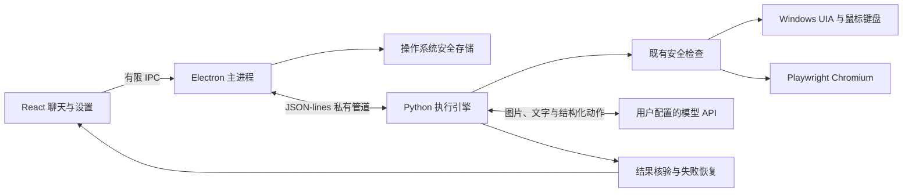

# 本机桌面 Agent 设计

目标是一个 Windows 优先的桌面 App：用户输入自然语言，App 观察和操作本机应用或独立浏览器，并验证结果。
Muse、Grok Bot 用于参考电脑操控体验；产品不提供云电脑或云端运行服务。

## 语言与技术栈

| 层 | 选择 | 原因 |
| --- | --- | --- |
| 桌面界面与主进程 | TypeScript、React、Electron | 适合聊天、流式事件、会话、设置、系统快捷键和安装包；桌面生态成熟 |
| Agent 与平台执行 | Python | 复用现有的规划、定位、安全、核验、恢复和跨平台适配，避免重写已验证代码 |
| 进程间通信 | 私有管道上的 JSON-lines | API Key 只经主进程到执行器；无需开放本地 HTTP 端口；方便停止整个执行进程 |

Tauri + Rust 是追求安装体积时可考虑的方案，但仍需要处理 Python sidecar、权限与跨平台打包。
纯 Python + Qt 能快速完成传统桌面界面；当前产品的聊天与活动流更适合 React，且已有 Python 引擎可独立复用。
第一版不新增 Rust/C++ 重写工作。

## 交互与实现

- **聊天式任务**：对话列表、任务输入、执行计划、操作记录、核验状态、报告入口；只有引擎 `done` 结果显示完成。
- **本机操作**：Windows 的 UIA/截图/鼠标键盘复用现有适配器；独立浏览器复用 Playwright。
- **自定义模型**：用户在界面配置协议、Base URL、API Key、模型 ID；所有角色使用同一模型，无需默认本地定位服务器。
- **可观察执行**：从真实环境观察生成界面预览，展示实际执行与核验事件；历史不保存预览的 base64 数据。
- **人工介入**：确认与提问通过管道等待当前请求的回答，绑定运行和请求 ID；拒绝继续由原安全闸门处理。
- **暂停与停止**：暂停在观察/执行边界生效；暂停后丢弃旧观察对应的动作，重新判断。停止通过终止进程树中断尚未结束的模型或平台调用。
- **连续任务**：同一会话复用当前执行环境，保留此前任务结果摘要；切换会话和修改设置会重建执行器。
- **打包**：PyInstaller 冻结 Python 引擎与平台依赖，安装包包含 Chromium；Electron Builder 生成 Windows NSIS 安装器。

界面使用 Electron context isolation、sandbox 与关闭 Node integration 的 renderer；preload 仅暴露明确的操作。
主进程验证 IPC 参数和调用 frame，不提供任意文件访问、任意 shell 或任意 IPC 调用。
API Key 在 Windows 使用操作系统保护加密；截图、敏感输入与模型出口沿用既有引擎的隐私边界。

## 参考的公开资料

这些资料用于参考可见功能和公开电脑操控协议；本项目没有获得闭源产品的内部实现。

- [智谱 ZCode Agent](https://zcode.z.ai/en/docs/agent-framework)：统一任务、模型、权限确认、执行历史与工具面板；[ZCode 开源仓库](https://github.com/zai-org/ZCode)。
- [OpenAI Codex Computer Use](https://developers.openai.com/codex/app/computer-use)：本机应用操作、用户授权与接管体验。
- [Anthropic Computer Use 工具](https://platform.claude.com/docs/en/agents-and-tools/tool-use/computer-use-tool)：模型提出截图/点击/输入请求，由应用在自己控制的电脑环境执行。桌面 MVP 使用普通 Messages + JSON 动作，没有宣称实现其全部原生 computer-use toolset。
- [Claude 电脑操控的实践](https://claude.com/resources/articles/best-practices-for-computer-and-browser-use-with-claude)：观察、坐标空间、工具选择与执行反馈。
- [Meta Muse 的安全设计](https://research.meta.ai/blog/security-and-safety-for-ai-agents-our-approach-with-muse)：长期任务的可观察活动、用户介入、凭据与执行环境的分工。
- [Grok Bot 的电脑与应用](https://docs.x.ai/grok-bot/computer-and-apps)：持续会话、电脑可见性和人工操作的协作方式。
- [Electron 安全指南](https://www.electronjs.org/docs/latest/tutorial/security/) 与 [safeStorage](https://www.electronjs.org/docs/latest/api/safe-storage/)：renderer 隔离和系统安全存储。

## 验证范围

v0.5 增加了原生控件路径、元素身份绑定、指定字段输入、界面等待优化与耗时统计，详见 [执行改进与基准](execution-improvements.md)。

桌面端测试覆盖配置、加密存储、事件状态，以及真实 Electron → Python → Chromium 执行链路。
模型 API 测试使用本地 HTTP 服务提供确定性的回复，验证协议和实际操作；不据此报告真实模型自主成功率。
Windows CI 构建安装包，运行冻结引擎的浏览器任务及真实 WinForms/UIA 控件检查。原生检查范围有限，复杂本机应用仍需在交互式 Windows 桌面实测，不能由 Linux 浏览器验证代替。
