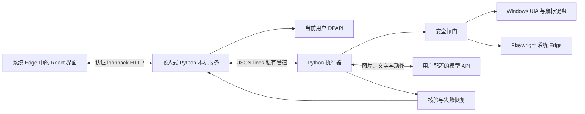

# 本机桌面 Agent 设计

目标是一个 Windows 优先的桌面 App：用户输入自然语言，App 观察和操作本机应用或独立浏览器，并验证结果。
Meta Muse、Grok Bot 用于参考公开的执行设计和电脑操控体验；产品不提供云电脑或云端运行服务。
v0.6 的 RemoteEnv、Linux 沙盒和 Docker 镜像是可选的开发、评测与 MCP 工具，不改变本机桌面 App 的产品方向。

## v0.8 语言与技术栈

| 层 | 选择 | 原因 |
| --- | --- | --- |
| 界面 | React、TypeScript、系统 Edge App 窗口 | 复用系统浏览器，保留聊天与活动流体验，避免分发 Electron |
| 本机服务与执行器 | 嵌入式 Python | 复用已有规划、定位、安全、核验、恢复、UIA 与 Web 适配 |
| 启动器 / 安装 | 小型 C# 启动器、NSIS 单用户安装 | 无控制台启动、无需管理员权限；构建时使用系统 .NET 编译器 |
| 通信 | 认证 loopback HTTP + 私有 JSON-lines 管道 | 界面只访问受限 API；模型凭据从服务经私有管道传给执行器 |

v0.5–v0.7 使用 Electron/PyInstaller/内置 Chromium。v0.8 按安装体积和清理需求替换该层，保留已有 Agent 引擎，不额外重写成 Rust/C++。

## 交互与边界

- 聊天、执行画面、步骤、确认、暂停/接管、停止、结果与报告继续保留；只有实际引擎核验结果为 `done` 才显示完成。
- 本机服务只绑定 `127.0.0.1` 随机端口；每次运行生成新的高熵控制令牌，验证 Host/Origin，不开放 CORS；浏览器只暴露明确的 API，没有任意文件或 shell 入口。
- 界面启动 URL 的控制令牌放在 fragment，前端读取后清除 URL；模型 API Key 不出现在 argv，通过私有管道进入执行器。控制令牌不隔离同一 Windows 用户的其他进程。
- 界面和任务使用软件自己的 Edge profile，保持个人 Edge 数据独立；Windows Job Object 管理软件创建的子进程树。
- 截图默认不保存；报告/历史有期限、数量和字节上限；临时目录和 UIA COM 缓存集中保存，退出清理。
- 安装与注册表写入当前用户；卸载删除软件程序、数据、登记及快捷方式，清理不跟随 junction/symlink。

完整使用、目录策略和构建说明见 [desktop/README.md](../desktop/README.md)。

## 参考的公开资料

这些资料用于参考可见功能和公开电脑操控协议；本项目没有获得闭源产品的内部实现。

- [智谱 ZCode Agent](https://zcode.z.ai/en/docs/agent-framework)：统一任务、模型、权限确认、执行历史与工具面板；[ZCode 开源仓库](https://github.com/zai-org/ZCode)。
- [OpenAI Codex Computer Use](https://developers.openai.com/codex/app/computer-use)：本机应用操作、用户授权与接管体验。
- [Anthropic Computer Use 工具](https://platform.claude.com/docs/en/agents-and-tools/tool-use/computer-use-tool)：模型提出截图/点击/输入请求，由应用在自己控制的电脑环境执行。桌面 MVP 使用普通 Messages + JSON 动作，没有宣称实现其全部原生 computer-use toolset。
- [Claude 电脑操控的实践](https://claude.com/resources/articles/best-practices-for-computer-and-browser-use-with-claude)：观察、坐标空间、工具选择与执行反馈。
- [Meta Muse 的公开安全设计](https://research.meta.ai/blog/security-and-safety-for-ai-agents-our-approach-with-muse)（2026-09-08）：隔离的 Linux 执行环境、外部 Sentinel 权限与网络控制、凭据代理和权限分离。2026-10-08 已核对该官方来源；这里只作为设计参考，没有接入 Muse 实现，也不据此宣称具有同等隔离能力。
- [Grok Bot 的电脑与应用](https://docs.x.ai/grok-bot/computer-and-apps)：持续会话、电脑可见性和人工操作的协作方式。
- [Python Windows embedded distribution](https://docs.python.org/3/using/windows.html#the-embeddable-package)：随应用分发隔离的 Python runtime。
- [Windows DPAPI](https://learn.microsoft.com/en-us/windows/win32/api/dpapi/nf-dpapi-cryptprotectdata) 与 [Job Objects](https://learn.microsoft.com/en-us/windows/win32/procthread/job-objects)：当前用户凭据保护和子进程生命周期。

## 验证范围

v0.5 增加了原生控件路径、元素身份绑定、指定字段输入、界面等待优化与耗时统计，详见 [执行改进与基准](execution-improvements.md)。

桌面端测试覆盖配置、加密存储、事件状态、认证 HTTP、存储上限和清理，以及真实 React → Python → 浏览器执行链路。
模型 API 测试使用本地 HTTP 服务提供确定性的回复，验证协议和实际操作；不据此报告真实模型自主成功率。
Windows CI 构建安装包，运行嵌入式 Python 的系统 Edge 任务及真实 WinForms/UIA 控件检查，并验证安装、退出、升级和卸载。原生检查范围有限，复杂本机应用仍需在交互式 Windows 桌面实测，不能由 Linux 浏览器验证代替。
